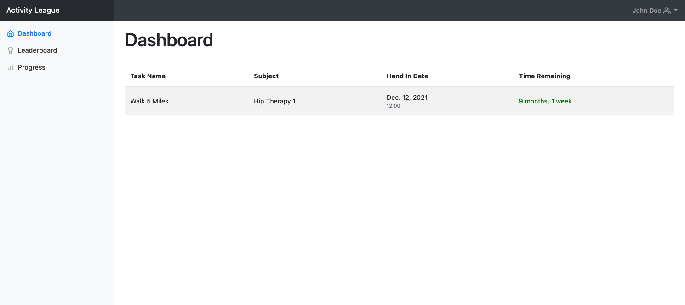
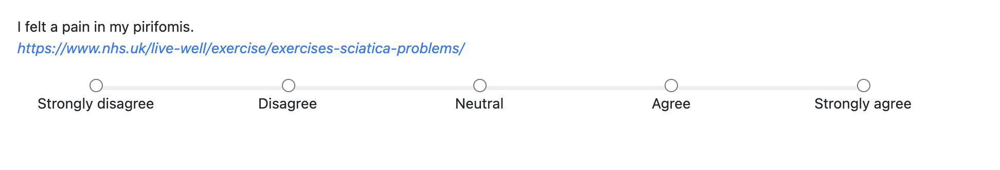
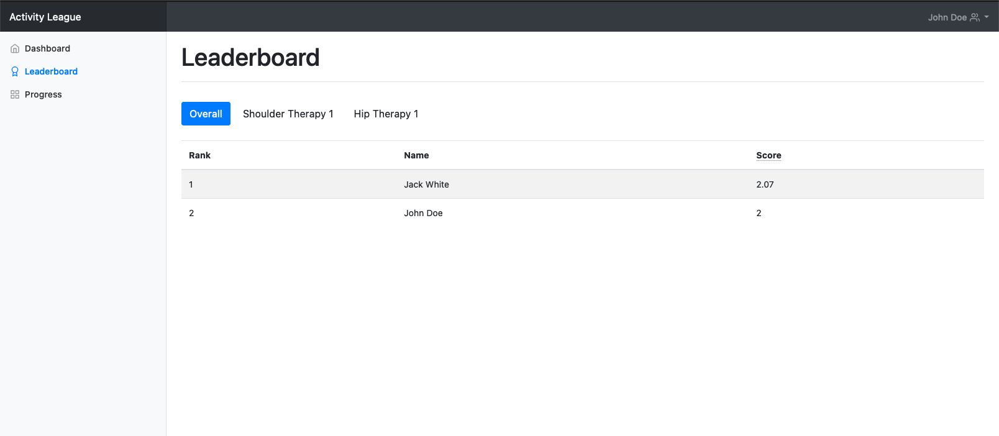
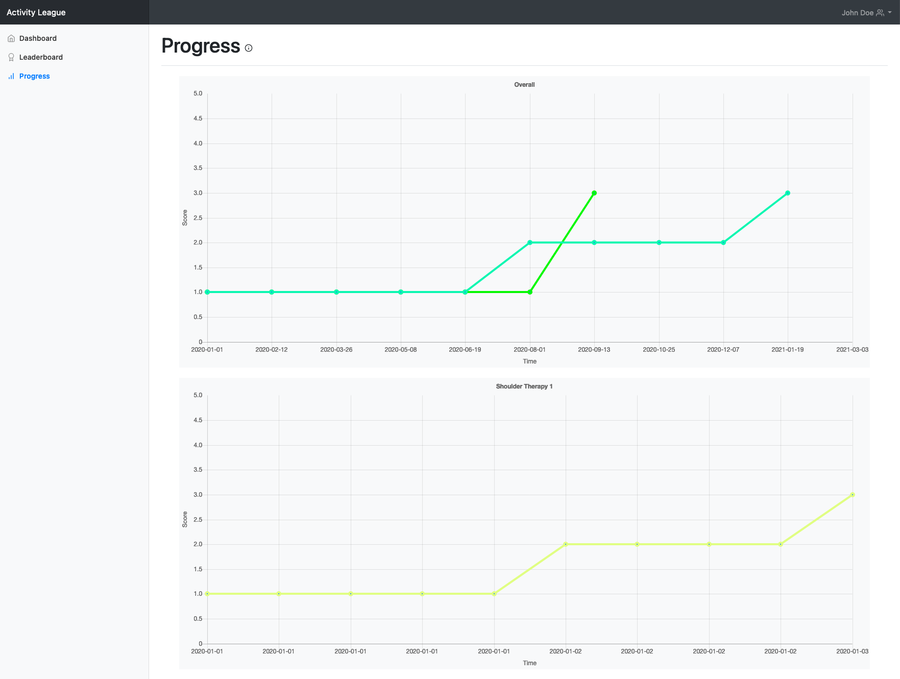

# Respondent

## Launch the Application

To open the application, navigate to [178.79.143.29:8000](//178.79.143.29:8000) in your browser.

## Signing Up

If you are invited to join an organisation, clicking the invite link will redirect you to the sign up page.

Enter your email address, first name, surname and password.

Once you've entered this, click the `Sign Up` button below to complete the registration process!
After signing up, you will automatically be added to the group that you were invited to.

## Dashboard

The dashboard shows you all of the tasks that have been assigned to you which you have yet to complete.
Clicking on a task will take you that task's feedback form, where you can submit your response.

### Responding to Tasks

There are 4 main types of question which you may be asked to answer. Each question may have an associated link to help you with your answer.

#### Likert Scale

Likert scale questions allow radio button responses from 'Strongly Disagree' to 'Strongly Agree'.

#### 1-5 Scale

Similar to Likert scale questions, a 1-5 scale allows discrete numerical responses ranging from 1 to 5.

#### Traffic Light

Traffic light questions show three buttons colored red, yellow and green with sad, neutral and happy faces respectively.

#### Text

Text questions simply show a text field in which you can input your response.

<figure>
  
</figure>

## Leaderboard

Clicking on the [Leaderboard](//178.79.143.29:8000/leaderboard) tab in the sidebar will take you to the page below, where you can view your ranking among all the different groups of which you are a member.

By default the `Overall` button will be selected, which shows your ranking across all groups that you manage. You can click on buttons for individual groups to show the leaderboard for that specific group.

## Progress

The [progress](//178.79.143.29:8000/progress) page allows you to visualise your progress over time within a group and overall since you joined Activity League.

The graph at the top of the progress page is the **Overall** graph, and contains a summary of your progress across all groups that you are in. Each subsequent graph below this represents your progress in each group that you are present.

The [scores](#scoring) shown are averages over the responses that you have submitted to the questions in the tasks that you have been set. Activity League is designed to promote higher scores, meaning that the leaderboard assumes that higher scores (meaning that response values are higher) indicate positivity, and lower scores indicate negativity. This does not apply to text-based responses.

## Scoring

Activity League averages the quantitative responses that you enter over different time periods to generate scores for both the [leaderboard](#leaderboard) and [progress](#progress) graphs.
Activity league assumes that **higher scores indicate positive responses** and **lower scores indicate negative responses**.

For example, if you enter a higher-valued response because you find tasks easier than before, the average score will increase over time and Activity League will assume that this is positive and desirable.