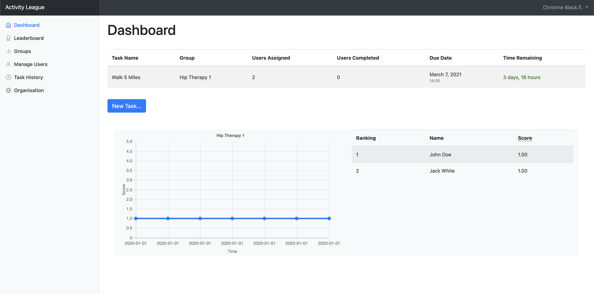
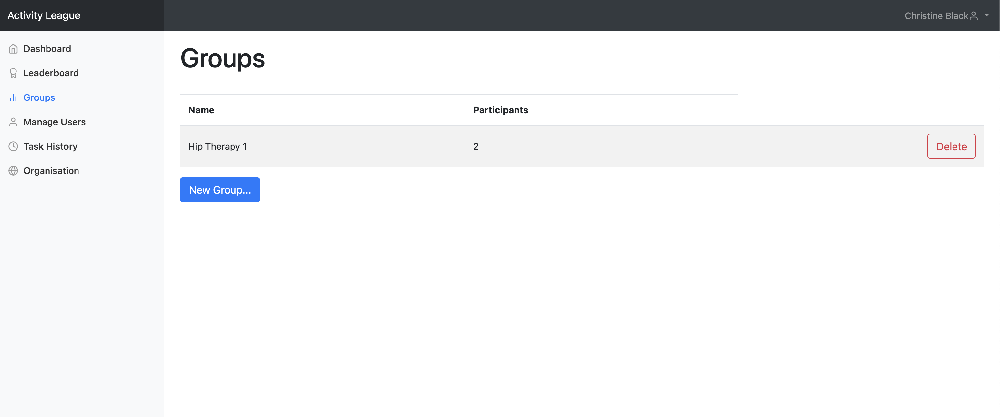
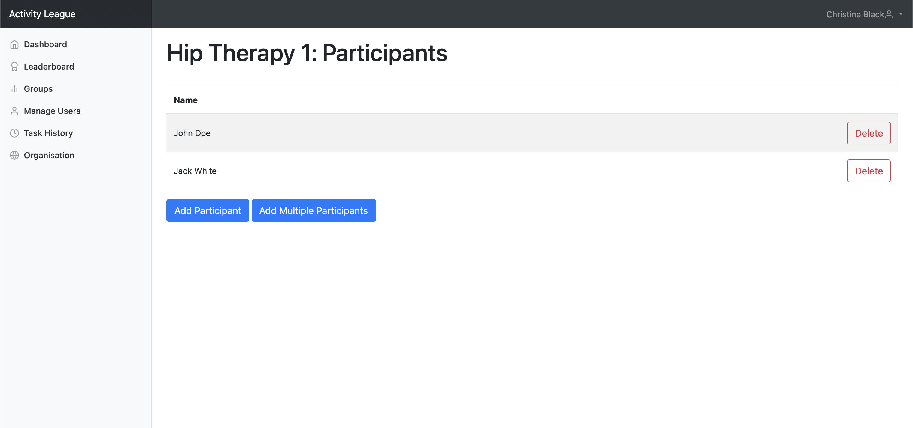
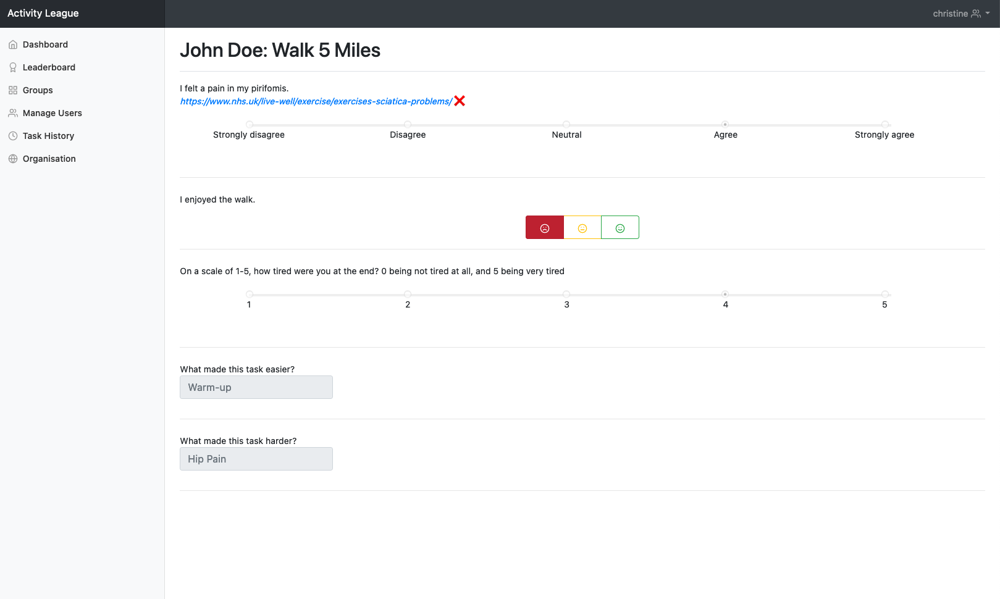

# Surveyor

## Launch the Application

To open the application, navigate to [178.79.143.29:8000](//178.79.143.29:8000) in your browser.

## Signing Up

### Creating an Organisation

From the Sign In page, click the [Create Organisation](//178.79.143.29:8000/create-organisation)
button at the bottom of the page. You'll be redirected to this page:

<figure>
  
</figure>

Enter the name of the organisation that you want to create, followed by your email address, firstname, surname and password.

Once you've entered this, click the `Sign Up` button below to complete the registration process!
You will be assigned as the [admin user](#admin-user) of that organisation.

### Accepting an Invitation

If you are invited to join an organisation, clicking the invite link will redirect you to the sign up page.

Enter your email address, first name, surname and password.

Once you've entered this, click the `Sign Up` button below to complete the registration process!
You will automatically be added as a member to the organisation from which you were invited.

## Dashboard

After logging in, you will be taken to your [dashboard](//178.79.143.29:8000/dashboard). From here you can view all of the
incomplete tasks that you have set so far.

Below the task list, there will be a number of graphs and leaderboards to show
you the progress of each group that you manage.

## Creating Tasks

Clicking the `Create Task` button on the dashboard will take you to the following page, where you can set information for a new task, along with the feedback questions that must be answered for this task.

You can add as many questions to the as you wish by clicking the `Add More` button.

Questions for a task can be one of the following types.

### Likert Scale

Likert scale questions allow radio button responses from 'Strongly Disagree' to 'Strongly Agree'.

### 1-5 Scale

Similar to Likert scale questions, a 1-5 scale allows discrete numerical responses ranging from 1 to 5.

### Traffic Light

Traffic light questions show three buttons colored red, yellow and green with sad, neutral and happy faces respectively.

### Text

Text questions can be split into three types:

- Negative
- Neutral
- Positive

These are useful for visualising different types
of text responses on the [User Overview](#user-overview) page.

<figure>
  
</figure>

## Task Overview

<!--  -->

The task overview page allows you to view information about a task and provides summary visualisations of responses to questions.

### Viewing visualisations of responses

Questions are shown within an "accordion" and you can click on an individual question to expand it by simply clicking on it.
If you provided a link for a question, the number of times it was clicked will be shown on that question's row.

### Marking tasks as complete/incomplete

You also have the option to mark a task as completed/incomplete by clicking on the `Mark as complete`/`Mark as incomplete` button at the bottom of the page. Completed tasks no longer show up on your dashboard but are still accessible through the [Task History](#task-history) page.

## Leaderboard

Clicking on the [Leaderboard](//178.79.143.29:8000/leaderboard) tab in the sidebar will take you to the page below, where you can
view how the progress of respondents that you manage compare against each other.

By default the `Overall` button will be selected,
which shows respondents across all groups that you manage. You can click on buttons for individual groups to show the rankings of respondents within that specific group.

### Scoring

Activity League averages the quantitative responses that Respondents enter over different time periods to generate scores. Activity league assumes that **higher scores indicate positive responses** and **lower scores indicate negative responses**.

For example, if Respondents enter a higher-valued response because they find tasks easier than before, the average score will increase over time and Activity League will assume that this is positive and desirable.

## Manage your Organisation

To view the members of your organisation, click on the [Organisation](//178.79.143.29:8000/organisation) tab in the sidebar.

You'll be redirected to this page:

### Admin User

For each organisation, there is **one** admin user. By default, the admin user is the user who creates the organisation during sign up.

The admin user has the special privilege of **deleting** members of the organisation. Though all members of the organisation may invite new members, only the admin user may delete them.

### Adding Members

There are two ways you can add members to the organisation:

1. Individually (through their email)
2. In bulk (using `.xlsx` spreadsheets)

#### Adding Members Individually

If you wish to add members individually, click on the `Add Member` button. This pop-up will appear:

<figure>
  
</figure>

Enter their email and press the `Send Invite` button. The invitations to the users are now on their way!

Once the user signs up through the invite link, they will be added to the organisation.

#### Adding Members in Bulk

This approach is recommended if you need to add many members at once. To do so, click on the `Add Multiple Members` button. The following pop-up will appear:

<figure>
  
</figure>

Here you may choose a spreadsheet containing a list of email addresses in a single column, looking like this:

<figure>
  
</figure>

After uploading your file, pressing the `Send Invites` button will send an invitation to all emails provided in the spreadsheet.

### Deleting Members

If you are the [admin user](#admin-user) of the organisation, you can also **delete** members by clicking on the `Delete` button on that member's row.

!!! Warning
    Deleting a member from your organisation deregisters them from the system. To access the system again, they will need to sign up.

## Managing Groups

To manage your groups, click on the [Groups](//178.79.143.29:8000/groups) tab in the sidebar.

You'll be redirected to this page:

Clicking on a group's row will redirect you to a page where you can manage that [individual group](#managing-individual-groups).

### Creating Groups

To create a group, navigate to the [groups](//178.79.143.29:8000/groups) page and click on the `New Group` button. A pop-up like this will appear:

<figure>
  
</figure>

Give the group that you want to create a name in the pop-up. When you're done, click the `Create Group` button on the same pop-up. Once you've done this: congratulations! You've created a new group.!

### Deleting Groups

To delete a group simply click the `Delete` button on that group's row. A confirmation dialog will appear, after which the group will be deleted.

!!! Warning
    Deleting a group will also delete all tasks assigned to that group, and subsequently all past responses to those tasks.

## Managing Individual Groups

The page for managing an indivual group looks like this:

Clicking on an individual user's row will redirect you to the [User Overview](#user-overview) page.

### Add Group Participants

There are two ways you can add users to a group:

1. Individually (through their email)
2. In bulk (using `.xlsx` spreadsheets)

#### Adding Users Individually

If you wish to add users individually (recommended if you already manage the users that you wish to add in another group, or if the number of users that you wish to add is small), click on the `Add Participant` button. This pop-up will appear:

<figure>
  
</figure>

If you already manage the user that you wish to add in another group, you'll be able to select them from the drop-down menu at the top of the pop-up and select the user you wish to add from there.

If you do not already manage them, add their email in the text field below.

Once you've done either of these, press the `Send Invite` button. The invitation will be sent to the user!

!!! Info
    If the new, added user doesn't already have an account they won't appear immediately. They'll show up after they have accepted the email invitation and have created an account.

#### Adding Users in Bulk

This approach is recommended if you need to add many users at once. To do so, click on the `Add Multiple Participants` button. The following pop-up will appear:

<figure>
  
</figure>

Here you may choose a spreadsheet containing a list of email addresses in a single column, looking like this:

<figure>
  
</figure>

After uploading your file, pressing the `Send Invites` button will send an invitation to all emails provided in the spreadsheet.

### Removing Users

You can remove users from a group by clicking on the `Delete` button on that user's row.

!!! Info
    Removing a user from a group will **not** delete any responses they submitted to tasks assigned to that group.

## Users

To view all the users you manage, click on the [Manage Users](//178.79.143.29:8000/users) tab in the sidebar.

This will take you to the following page:

You can sort and search through all the users on this page.

Clicking on an individual user's row will redirect you to the [User Overview](#user-overview) page, where you can view that user's progress in more detail.

### User Overview

The User Overview page looks like this:

At the top of the page, there can be up to three different word clouds (based on which questions they have answered so far), each summarising the user's responses to negative, neutral and positive questions.

Below this, you can view a graph of the user's progress over time for each group they are a member of.
You can click on buttons for individual groups to show the progress graph for the user within that specific group.

Below the graph, there is a list of all the tasks that the user has completed. You can sort and search through all of these tasks. Clicking on an individual task in the list will redirect you to the [Individual User Response](#individual-user-response) page.

#### Individual User Response

This page shows the exact response of the user to the specified task and looks ike this:

Questions where a link was provided have either a ✅ or ❌ next to them, respresenting whether or not that link was clicked by the user.